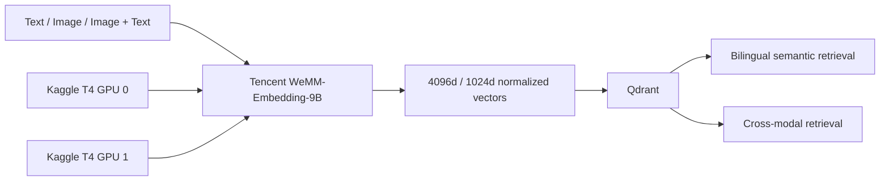

# Tencent-WeMM-Embedding-9B-Kaggle-T4x2-GPU

**Independent Kaggle T4×2 engineering project for Tencent WeMM-Embedding-9B**

> 🌐 Language / Ngôn ngữ: **English** | [Tiếng Việt](README.vi.md)

[](https://github.com/dangkhoa2016/Tencent-WeMM-Embedding-9B-Kaggle-T4x2-GPU/actions/workflows/ci.yml)
[](https://github.com/dangkhoa2016/Tencent-WeMM-Embedding-9B-Kaggle-T4x2-GPU/releases/tag/v1.0.0)
[](LICENSE)
[](https://www.python.org/)
[](https://www.kaggle.com/)
[](https://qdrant.tech/)

Run **Tencent WeMM-Embedding-9B** on a Kaggle **NVIDIA T4 ×2** notebook for multilingual text, image, and image+text embeddings — with a ready-to-run notebook, reusable Python runtime, local REST API, Qdrant retrieval demo, and reproducible validation.

> **v1.0.0** is the first public stable release of this repository for community use, review, and reproducibility testing.

> **Tencent WeMM-Embedding-9B** is part of the [WeMM-Embedding](https://github.com/Tencent/WeMM-Embedding) family developed by the **WeChat Vision Team at Tencent**. This repository is an independent community engineering project built around that upstream Tencent WeMM-Embedding-9B model and is **not an official release from Tencent or WeChat**.

## What you can do

- Embed **English and Vietnamese text**.
- Embed **images**.
- Embed **image + text pairs**.
- Produce normalized **4096d** or **1024d** Matryoshka vectors.
- Run bilingual semantic retrieval over a verified **99,967-entity Wikidata corpus**.
- Run image→text cross-modal retrieval.
- Run transformed-image→original-image robustness retrieval.
- Use Python directly or call a **loopback FastAPI REST service**.
- Reuse verified Qdrant snapshots instead of rebuilding the corpus on every demo run.
- Reproduce the public demonstration on **Kaggle T4 ×2**.

## Results at a glance

The public demo contains two independent evaluation spaces. They are reported separately and should not be interpreted as one universal benchmark.

| Capability | Search space | Public result |
| --- | ---: | ---: |
| Bilingual + cross-modal semantic retrieval | 99,967 entities per Qdrant collection | **36/36 TOP-1** |
| Visual robustness retrieval | isolated gallery of 4 original images | **32/32 TOP-1** |
| Total executed retrieval checks | two distinct spaces above | **68/68 PASS** |

For visual robustness, every evaluated path must rank the correct original image at **#1** with:

```text
raw cosine >= 0.90
```

Cosine values are raw similarity scores. They are **not rescaled** and are **not confidence percentages**.

## Start here

The easiest way to experience the project is the public notebook source:

[`notebooks/kaggle-production-demo-thin.ipynb`](notebooks/kaggle-production-demo-thin.ipynb)

It demonstrates:

1. hardware and Kaggle Input checks;
2. verified Qdrant reuse or snapshot restore;
3. loading Tencent WeMM-Embedding-9B across both T4 GPUs;
4. English ↔ Vietnamese text retrieval;
5. image → bilingual text retrieval;
6. transformed-image → original-image robustness retrieval;
7. clean GPU-worker and Qdrant shutdown.

### Kaggle requirements

| Requirement | Value |
| --- | --- |
| Platform | Kaggle Notebook |
| Accelerator | **GPU T4 ×2** |
| Internet | **ON** for the current public demo |
| Model input | `dangkhoa2016/tencent-wemm-embedding-9b`, version 1 |
| Dataset input | `dangkhoa2016/wemm-embedding-9b-v1-qdrant-snapshots`, version 1 |
| Runtime precision | FP16 |
| Qdrant | 1.19.0 |
| Qualified vector sizes | 4096d and 1024d |

### Quick start on Kaggle

1. Create or open a Kaggle Notebook.
2. Select **GPU T4 ×2** in Notebook options.
3. Add the model and dataset inputs listed above.
4. Import or upload [`notebooks/kaggle-production-demo-thin.ipynb`](notebooks/kaggle-production-demo-thin.ipynb).
5. Run the notebook from top to bottom.

The notebook uses strict preflight checks. If the accelerator, model input, dataset, snapshot, or model placement does not match the expected configuration, it stops rather than silently falling back.

## Using the Python runtime

The reusable model runtime lives in `wemm_runtime/`.

After the runtime is loaded:

```python
vector = runtime.embed_text(
    "Hồ Gươm nằm ở trung tâm Hà Nội.",
    dimension=1024,
)

image_vector = runtime.embed_image(
    image,
    dimension=4096,
)

multimodal_vector = runtime.embed_image_texts(
    [(image, "A historic building beside a lake")],
    dimension=1024,
)
```

The runtime normalizes embeddings and supports the qualified Matryoshka dimensions `4096` and `1024`.

For the complete Kaggle configuration, use the notebook or the provided setup scripts instead of manually reconstructing the model loader.

## Local REST API

The repository includes a FastAPI service intended for **loopback/local notebook use**.

### Start the API

```bash
export WEMM_API_TOKEN='replace-with-a-random-token-at-least-32-characters'
bash kaggle/setup-api.sh
bash kaggle/run-api.sh
```

Default address:

```text
http://127.0.0.1:8090
```

### Health and readiness

```bash
curl http://127.0.0.1:8090/healthz
curl http://127.0.0.1:8090/readyz
```

### Text embeddings

```bash
curl -X POST http://127.0.0.1:8090/v1/embeddings/text \
  -H "Authorization: Bearer $WEMM_API_TOKEN" \
  -H "Content-Type: application/json" \
  -d '{
    "inputs": [
      "Hồ Gươm nằm ở trung tâm Hà Nội.",
      "Hoan Kiem Lake is in central Hanoi."
    ],
    "dimension": 1024
  }'
```

### Image embeddings

```bash
curl -X POST http://127.0.0.1:8090/v1/embeddings/image \
  -H "Authorization: Bearer $WEMM_API_TOKEN" \
  -F "images=@example.jpg" \
  -F "dimension=4096"
```

### Image + text embeddings

```bash
curl -X POST http://127.0.0.1:8090/v1/embeddings/image-text \
  -H "Authorization: Bearer $WEMM_API_TOKEN" \
  -F "images=@example.jpg" \
  -F "texts=A historic building beside a lake" \
  -F "dimension=1024"
```

The API enforces bearer-token authentication, bounded batches, request limits, image validation, and loopback binding. It is **not presented as an Internet-facing multi-tenant inference service**.

## Project layout

```text
.
├── notebooks/
│   └── kaggle-production-demo-thin.ipynb  # Best starting point
├── wemm_runtime/                           # Reusable provider-neutral runtime
├── wemm_kaggle/                            # Kaggle integration + public demo
├── kaggle/                                 # Setup, preflight, API and launch scripts
├── scripts/                                # Acceptance, benchmark and policy tools
├── tests/                                  # CPU-compatible unit/contract tests
├── .github/                                # CI and community health files
├── requirements-kaggle.txt
├── requirements-api.txt
├── requirements-demo.txt
├── LICENSE
└── VERSION
```

If you only want to run the demo, start with the notebook.

If you want to integrate the runtime into another Python workflow, start with `wemm_runtime/`.

If you want the REST service, use `kaggle/setup-api.sh` and `kaggle/run-api.sh`.

## Documentation

The README is the project landing page. Detailed guides live in the [Documentation Hub](docs/index.md).

| Topic | Guide |
| --- | --- |
| Getting started | [Documentation Hub](docs/index.md) |
| Kaggle setup and execution | [Kaggle Guide](docs/kaggle.md) |
| System design | [Architecture](docs/architecture.md) |
| Supported capabilities | [Features](docs/features.md) |
| Reusable Python integration | [Python Runtime](docs/python-runtime.md) |
| Local service reference | [REST API](docs/api.md) |
| Model and dataset boundaries | [Model and Data](docs/model-and-data.md) |
| Qdrant collections and snapshots | [Qdrant](docs/qdrant.md) |
| Evaluation methodology | [Retrieval and Evaluation](docs/retrieval-and-evaluation.md) |
| Reproduction contract | [Reproducibility](docs/reproducibility.md) |
| Known boundaries | [Limitations](docs/limitations.md) |
| Common failures | [Troubleshooting](docs/troubleshooting.md) |
| Contributor workflow | [Development](docs/development.md) |
| Future directions | [Roadmap](docs/roadmap.md) |
| Release history | [CHANGELOG](CHANGELOG.md) |

## Architecture



The public Kaggle notebook/demo executes model workloads through the isolated `SubprocessEmbeddingWorker` so GPU state can be reclaimed predictably at demo closeout.

The loopback FastAPI service currently owns an in-process model runtime behind a single-threaded inference scheduler. Its service lifecycle is separate from the notebook/demo subprocess worker. See [Architecture](docs/architecture.md).

## Verified runtime profile

| Property | Verified value |
| --- | --- |
| GPUs | NVIDIA T4 ×2 |
| Precision | FP16 |
| GPU0 mapped modules | 13 |
| GPU1 mapped modules | 24 |
| Total mapped modules | 37 |
| CPU offload | none |
| Disk offload | none |
| Embedding dimensions | 4096, 1024 |
| Qdrant | 1.19.0 |
| Runtime source pinned by public notebook | `224f07cd1d6eb174d3532c9eaeeb9abd606a857f` |

The runtime validates the model directory, local safetensors, device map, GPU placement, supported dimensions, and offload targets before accepting the configuration.

## Semantic retrieval demo

The semantic portion uses two verified Qdrant collections:

```text
wikidata_en_vi_wemm9b_4096_v030_rc2_d819dc7_v1
wikidata_en_vi_wemm9b_1024_v030_rc2_d819dc7_v1
```

Each contains **99,967 entities** with named English and Vietnamese vectors using cosine distance.

The public semantic showcase covers English→Vietnamese and Vietnamese→English text retrieval, 4096d/1024d vectors, and image→English/Vietnamese text retrieval. Across these defined public paths, the expected entity is retrieved at rank #1 in **36/36 checks**.

This is a reproducibility result for the published showcase and corpus configuration, not a claim of universal retrieval accuracy.

## Visual robustness demo

The visual section is intentionally separate from the 99,967-entity semantic corpus.

It uses four original images and four real transformations:

- resize to 80%;
- JPEG quality 90;
- center crop to 96%;
- brightness 103%.

Each transformed query is searched at both 4096d and 1024d:

```text
4 images × 4 transforms × 2 dimensions = 32 retrieval checks
```

All **32/32** published paths retrieve the correct original image at rank #1 and meet the raw cosine threshold of `0.90`.

The gallery contains exactly four original images and is temporary. It is not written into the production semantic Qdrant corpus.

## Reproducibility and testing

v1.0.0 release qualification baseline:

```text
470 passed
3 skipped
234 Markdown link targets
```

Pytest warning totals can vary with the resolved transitive test environment. They are recorded in each CI run and are not treated as a source invariant.

Equivalent repository checks:

```bash
python -m pip install --index-url https://download.pytorch.org/whl/cpu torch
python -m pip install pytest packaging pillow -r requirements-api.txt -r requirements-demo.txt -r requirements-search.txt

python scripts/check_bilingual_docs.py --history
python scripts/check_doc_links.py
python scripts/check_publication_policy.py
python -m pytest -q
python -m compileall -q wemm_runtime wemm_kaggle scripts
bash -n kaggle/*.sh
git diff --check
```

CPU CI verifies source-level contracts. It does **not** replace the Kaggle T4 ×2 hardware run.

## Important limitations

- The verified GPU configuration is **Kaggle T4 ×2**.
- The public notebook expects the named Kaggle model and dataset inputs.
- The API binds to loopback and is not hardened as a public Internet service.
- The project does not provide SLA, HA, autoscaling, or multi-tenant guarantees.
- `36/36` and `32/32` are results from defined public showcase paths, not universal model-accuracy claims.
- The visual gallery contains four curated originals and is not the 99,967-entity semantic corpus.
- Model weights and datasets are not relicensed by this repository.

## Community and support

- [Contributing](.github/CONTRIBUTING.md)
- [Code of Conduct](.github/CODE_OF_CONDUCT.md)
- [Security Policy](.github/SECURITY.md)
- [Support](.github/SUPPORT.md)
- [Issues](https://github.com/dangkhoa2016/Tencent-WeMM-Embedding-9B-Kaggle-T4x2-GPU/issues)
- [Releases](https://github.com/dangkhoa2016/Tencent-WeMM-Embedding-9B-Kaggle-T4x2-GPU/releases)

For security-sensitive reports, follow [SECURITY.md](.github/SECURITY.md) rather than opening a public issue.

## License

Repository source code is released under the [MIT License](LICENSE).

```text
Copyright (c) 2026 Đăng Khoa <i.am@dangkhoa.dev>
```

The MIT license applies to source code in this repository. Tencent WeMM-Embedding-9B model weights, datasets, Kaggle services, Qdrant, and other third-party dependencies remain subject to their own upstream licenses and terms.

## Author

**Đăng Khoa**<br>
`i.am@dangkhoa.dev`

## Acknowledgements

This project builds on Tencent WeMM-Embedding-9B, PyTorch, Hugging Face Transformers, Qdrant, FastAPI, and Kaggle. Their projects, trademarks, models, services, and licenses remain independent of this repository.
