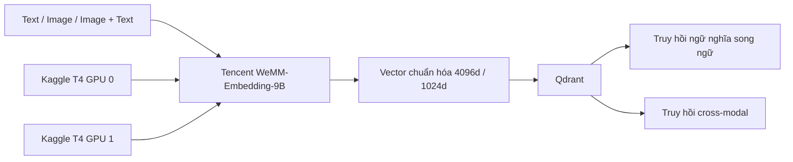

# Tencent-WeMM-Embedding-9B-Kaggle-T4x2-GPU

**Dự án kỹ thuật độc lập cho Tencent WeMM-Embedding-9B trên Kaggle T4×2**

> 🌐 Language / Ngôn ngữ: [English](README.md) | **Tiếng Việt**

[](https://github.com/dangkhoa2016/Tencent-WeMM-Embedding-9B-Kaggle-T4x2-GPU/actions/workflows/ci.yml)
[](https://github.com/dangkhoa2016/Tencent-WeMM-Embedding-9B-Kaggle-T4x2-GPU/releases/tag/v1.0.0)
[](LICENSE)
[](https://www.python.org/)
[](https://www.kaggle.com/)
[](https://qdrant.tech/)

Chạy **Tencent WeMM-Embedding-9B** trên Kaggle với **hai GPU NVIDIA T4** để tạo embedding cho văn bản, hình ảnh và ảnh+kèm văn bản — kèm notebook có thể chạy lại, Python runtime tái sử dụng được, REST API cục bộ, demo truy hồi bằng Qdrant và bộ kiểm tra khả năng tái lập.

> **v1.0.0** là bản phát hành ổn định công khai đầu tiên của repository này, dành cho cộng đồng sử dụng, đánh giá và kiểm tra khả năng tái lập.

> **Tencent WeMM-Embedding-9B** thuộc họ [WeMM-Embedding](https://github.com/Tencent/WeMM-Embedding) do **đội ngũ WeChat Vision tại Tencent** phát triển. Repository này là một dự án kỹ thuật cộng đồng độc lập được xây dựng xung quanh upstream Tencent WeMM-Embedding-9B model đó và **không phải bản phát hành chính thức của Tencent hoặc WeChat**.

## Bạn có thể làm gì với dự án này?

- Tạo embedding cho **văn bản tiếng Anh và tiếng Việt**.
- Tạo embedding cho **hình ảnh**.
- Tạo embedding cho **cặp ảnh + văn bản**.
- Sinh vector Matryoshka chuẩn hóa **4096 chiều** hoặc **1024 chiều**.
- Chạy semantic retrieval trên corpus Wikidata song ngữ **99.967 thực thể**.
- Chạy truy hồi cross-modal từ ảnh sang text.
- Kiểm tra độ ổn định của embedding khi ảnh bị biến đổi.
- Gọi model trực tiếp từ Python hoặc qua **REST API FastAPI cục bộ**.
- Tái sử dụng Qdrant snapshot đã xác minh thay vì dựng lại corpus ở mỗi lần demo.
- Tái lập public demo trên **Kaggle T4 ×2**.

## Kết quả nổi bật

Public demo gồm hai không gian đánh giá độc lập. Hai nhóm được báo cáo riêng và không nên được hiểu như một benchmark duy nhất.

| Khả năng | Không gian tìm kiếm | Kết quả công khai |
| --- | ---: | ---: |
| Truy hồi ngữ nghĩa song ngữ + cross-modal | 99.967 thực thể trên mỗi Qdrant collection | **36/36 TOP-1** |
| Truy hồi ảnh kiểm tra độ ổn định | gallery tách biệt gồm 4 ảnh gốc | **32/32 TOP-1** |
| Tổng số retrieval check đã thực thi | hai không gian riêng ở trên | **68/68 PASS** |

Ở phần visual robustness, mỗi đường truy hồi chỉ PASS khi ảnh gốc đúng đứng **hạng #1** và:

```text
raw cosine >= 0.90
```

Cosine được hiển thị nguyên bản, **không rescale** và **không được gọi là phần trăm độ tin cậy**.

## Bắt đầu từ đâu?

Cách đơn giản nhất để trải nghiệm dự án là notebook công khai:

[`notebooks/kaggle-production-demo-thin.ipynb`](notebooks/kaggle-production-demo-thin.ipynb)

Notebook lần lượt:

1. kiểm tra phần cứng và Kaggle Input;
2. tái sử dụng Qdrant đã xác minh hoặc restore snapshot;
3. load Tencent WeMM-Embedding-9B lên cả hai GPU T4;
4. truy hồi văn bản Anh ↔ Việt;
5. truy hồi ảnh → text song ngữ;
6. truy hồi ảnh đã biến đổi → ảnh gốc;
7. đóng worker, giải phóng GPU và kết thúc Qdrant sạch sẽ.

### Yêu cầu trên Kaggle

| Thành phần | Giá trị |
| --- | --- |
| Nền tảng | Kaggle Notebook |
| Accelerator | **GPU T4 ×2** |
| Internet | **ON** cho public demo hiện tại |
| Model input | `dangkhoa2016/tencent-wemm-embedding-9b`, version 1 |
| Dataset input | `dangkhoa2016/wemm-embedding-9b-v1-qdrant-snapshots`, version 1 |
| Precision | FP16 |
| Qdrant | 1.19.0 |
| Kích thước vector đã xác minh | 4096d và 1024d |

### Chạy nhanh trên Kaggle

1. Tạo hoặc mở Kaggle Notebook.
2. Vào **Notebook options → Accelerator** và chọn **GPU T4 ×2**.
3. Add model và dataset input ở bảng trên.
4. Import hoặc upload [`notebooks/kaggle-production-demo-thin.ipynb`](notebooks/kaggle-production-demo-thin.ipynb).
5. Chạy notebook từ trên xuống dưới.

Notebook dùng kiểm tra fail-closed. Nếu accelerator, model input, dataset, snapshot hoặc placement của model không đúng cấu hình mong đợi, notebook sẽ dừng thay vì âm thầm chuyển sang execution path khác.

## Sử dụng Python runtime

Runtime tái sử dụng nằm trong `wemm_runtime/`.

Sau khi runtime đã được load:

```python
vector = runtime.embed_text(
    "Hồ Gươm nằm ở trung tâm Hà Nội.",
    dimension=1024,
)

image_vector = runtime.embed_image(
    image,
    dimension=4096,
)

multimodal_vector = runtime.embed_image_texts(
    [(image, "Một công trình lịch sử bên hồ")],
    dimension=1024,
)
```

Runtime chuẩn hóa vector và hỗ trợ hai kích thước Matryoshka đã xác minh là `4096` và `1024`.

Nếu muốn chạy đầy đủ trên Kaggle, nên dùng notebook hoặc các script setup có sẵn thay vì tự dựng model loader từ đầu.

## REST API cục bộ

Repository có FastAPI service dành cho **loopback / notebook cục bộ**.

### Khởi động API

```bash
export WEMM_API_TOKEN='thay-bang-token-ngau-nhien-it-nhat-32-ky-tu'
bash kaggle/setup-api.sh
bash kaggle/run-api.sh
```

Địa chỉ mặc định:

```text
http://127.0.0.1:8090
```

### Health và readiness

```bash
curl http://127.0.0.1:8090/healthz
curl http://127.0.0.1:8090/readyz
```

### Embedding văn bản

```bash
curl -X POST http://127.0.0.1:8090/v1/embeddings/text \
  -H "Authorization: Bearer $WEMM_API_TOKEN" \
  -H "Content-Type: application/json" \
  -d '{
    "inputs": [
      "Hồ Gươm nằm ở trung tâm Hà Nội.",
      "Hoan Kiem Lake is in central Hanoi."
    ],
    "dimension": 1024
  }'
```

### Embedding hình ảnh

```bash
curl -X POST http://127.0.0.1:8090/v1/embeddings/image \
  -H "Authorization: Bearer $WEMM_API_TOKEN" \
  -F "images=@example.jpg" \
  -F "dimension=4096"
```

### Embedding ảnh + văn bản

```bash
curl -X POST http://127.0.0.1:8090/v1/embeddings/image-text \
  -H "Authorization: Bearer $WEMM_API_TOKEN" \
  -F "images=@example.jpg" \
  -F "texts=Một công trình lịch sử bên hồ" \
  -F "dimension=1024"
```

API yêu cầu bearer token, giới hạn batch/request, kiểm tra input ảnh và chỉ cho phép bind vào loopback. Dự án **không mô tả API này như một public Internet-facing multi-tenant inference service**.

## Cấu trúc repository

```text
.
├── notebooks/
│   └── kaggle-production-demo-thin.ipynb  # Nên bắt đầu từ đây
├── wemm_runtime/                           # Runtime lõi, không phụ thuộc riêng Kaggle
├── wemm_kaggle/                            # Tích hợp Kaggle + public demo
├── kaggle/                                 # Setup, preflight, API và launcher scripts
├── scripts/                                # Acceptance, benchmark và policy tools
├── tests/                                  # Unit/contract tests có thể chạy trên CPU
├── .github/                                # CI và community health files
├── requirements-kaggle.txt
├── requirements-api.txt
├── requirements-demo.txt
├── LICENSE
└── VERSION
```

Nếu chỉ muốn xem dự án hoạt động, hãy bắt đầu bằng notebook.

Nếu muốn tích hợp runtime vào workflow Python khác, hãy xem `wemm_runtime/`.

Nếu cần REST API, sử dụng `kaggle/setup-api.sh` và `kaggle/run-api.sh`.

## Tài liệu

README là landing page của dự án. Hướng dẫn chi tiết nằm trong [Documentation Hub](docs/index.vi.md).

| Chủ đề | Tài liệu |
| --- | --- |
| Bắt đầu | [Documentation Hub](docs/index.vi.md) |
| Setup và chạy Kaggle | [Hướng dẫn Kaggle](docs/kaggle.vi.md) |
| Thiết kế hệ thống | [Kiến trúc](docs/architecture.vi.md) |
| Khả năng được hỗ trợ | [Tính năng](docs/features.vi.md) |
| Tích hợp Python | [Python Runtime](docs/python-runtime.vi.md) |
| Local service reference | [REST API](docs/api.vi.md) |
| Model và dataset boundaries | [Model và Data](docs/model-and-data.vi.md) |
| Qdrant collections và snapshots | [Qdrant](docs/qdrant.vi.md) |
| Evaluation methodology | [Retrieval và Evaluation](docs/retrieval-and-evaluation.vi.md) |
| Reproduction contract | [Reproducibility](docs/reproducibility.vi.md) |
| Giới hạn đã biết | [Limitations](docs/limitations.vi.md) |
| Lỗi thường gặp | [Troubleshooting](docs/troubleshooting.vi.md) |
| Contributor workflow | [Development](docs/development.vi.md) |
| Định hướng tương lai | [Roadmap](docs/roadmap.vi.md) |
| Lịch sử release | [CHANGELOG](CHANGELOG.vi.md) |

## Kiến trúc tổng quan



Public notebook/demo trên Kaggle chạy model workload qua `SubprocessEmbeddingWorker` tách biệt để trạng thái GPU có thể được thu hồi có kiểm soát khi demo closeout.

FastAPI loopback hiện giữ model runtime trong cùng process của service và đặt nó phía sau inference scheduler một luồng. Lifecycle của API tách biệt với subprocess worker của notebook/demo. Xem [Architecture](docs/architecture.vi.md).

## Cấu hình runtime đã xác minh

| Thuộc tính | Giá trị đã xác minh |
| --- | --- |
| GPU | NVIDIA T4 ×2 |
| Precision | FP16 |
| Module map trên GPU0 | 13 |
| Module map trên GPU1 | 24 |
| Tổng số module được map | 37 |
| CPU offload | không |
| Disk offload | không |
| Kích thước embedding | 4096, 1024 |
| Qdrant | 1.19.0 |
| Runtime source được public notebook pin | `224f07cd1d6eb174d3532c9eaeeb9abd606a857f` |

Runtime kiểm tra model directory, safetensors cục bộ, device map, placement GPU, dimension được hỗ trợ và offload target trước khi chấp nhận cấu hình.

## Demo semantic retrieval

Phần semantic dùng hai Qdrant collection đã được xác minh:

```text
wikidata_en_vi_wemm9b_4096_v030_rc2_d819dc7_v1
wikidata_en_vi_wemm9b_1024_v030_rc2_d819dc7_v1
```

Mỗi collection chứa **99.967 thực thể**, có named vector tiếng Anh và tiếng Việt, sử dụng cosine distance.

Public showcase gồm text Anh→Việt, text Việt→Anh, vector 4096d/1024d và ảnh→text Anh/Việt. Trong các public path đã định nghĩa, thực thể mong đợi đứng hạng #1 ở **36/36 checks**.

Đây là kết quả có thể tái lập của showcase và corpus configuration đã công bố, không phải tuyên bố về độ chính xác phổ quát của model.

## Demo visual robustness

Phần visual được tách hoàn toàn khỏi semantic corpus 99.967 thực thể.

Nó sử dụng bốn ảnh gốc và bốn phép biến đổi thực:

- resize còn 80%;
- JPEG quality 90;
- center crop còn 96%;
- brightness 103%.

Mỗi ảnh biến đổi được tìm kiếm ở cả 4096d và 1024d:

```text
4 ảnh × 4 phép biến đổi × 2 dimensions = 32 retrieval checks
```

Toàn bộ **32/32** public paths đưa ảnh gốc đúng lên hạng #1 và đạt raw cosine tối thiểu `0.90`.

Gallery này chỉ có bốn ảnh gốc, tồn tại tạm thời và không được ghi vào production semantic Qdrant corpus.

## Khả năng tái lập và kiểm thử

v1.0.0 release qualification baseline:

```text
470 passed
3 skipped
234 Markdown link targets
```

Tổng số warning của pytest có thể thay đổi theo môi trường resolve của các dependency transitive. Số warning được ghi nhận trong từng CI run, không được coi là source invariant.

Có thể chạy các repository check tương đương bằng:

```bash
python -m pip install --index-url https://download.pytorch.org/whl/cpu torch
python -m pip install pytest packaging pillow -r requirements-api.txt -r requirements-demo.txt -r requirements-search.txt

python scripts/check_bilingual_docs.py --history
python scripts/check_doc_links.py
python scripts/check_publication_policy.py
python -m pytest -q
python -m compileall -q wemm_runtime wemm_kaggle scripts
bash -n kaggle/*.sh
git diff --check
```

CPU CI xác minh contract ở mức source. Nó **không thay thế** hardware run trên Kaggle T4 ×2.

## Giới hạn cần biết

- Cấu hình GPU đã xác minh là **Kaggle T4 ×2**.
- Public notebook kỳ vọng đúng Kaggle model và dataset input được liệt kê ở trên.
- API chỉ bind loopback và chưa được harden như public Internet service.
- Dự án không cung cấp SLA, HA, autoscaling hoặc bảo đảm multi-tenant.
- `36/36` và `32/32` là kết quả của các public showcase path được định nghĩa rõ, không phải tuyên bố accuracy phổ quát.
- Visual robustness gallery chỉ gồm bốn ảnh curated và không phải semantic corpus 99.967 thực thể.
- Model weights và dataset không được relicensed bởi repository này.

## Cộng đồng và hỗ trợ

- [Hướng dẫn đóng góp](.github/CONTRIBUTING.vi.md)
- [Quy tắc ứng xử](.github/CODE_OF_CONDUCT.vi.md)
- [Chính sách bảo mật](.github/SECURITY.vi.md)
- [Hỗ trợ](.github/SUPPORT.vi.md)
- [Issues](https://github.com/dangkhoa2016/Tencent-WeMM-Embedding-9B-Kaggle-T4x2-GPU/issues)
- [Releases](https://github.com/dangkhoa2016/Tencent-WeMM-Embedding-9B-Kaggle-T4x2-GPU/releases)

Nếu vấn đề liên quan bảo mật, hãy làm theo hướng dẫn liên hệ riêng trong [SECURITY.vi.md](.github/SECURITY.vi.md) thay vì mở public issue.

## License

Source code trong repository được phát hành theo [MIT License](LICENSE).

```text
Copyright (c) 2026 Đăng Khoa <i.am@dangkhoa.dev>
```

MIT License áp dụng cho source code của repository này. Model weights của Tencent WeMM-Embedding-9B, dataset, dịch vụ Kaggle, Qdrant và dependency bên thứ ba tiếp tục tuân theo license và điều khoản riêng của upstream.

## Tác giả

**Đăng Khoa**<br>
`i.am@dangkhoa.dev`

## Lời cảm ơn

Dự án được xây dựng trên Tencent WeMM-Embedding-9B, PyTorch, Hugging Face Transformers, Qdrant, FastAPI và Kaggle. Project, trademark, model, service và license tương ứng của các bên này độc lập với repository.
