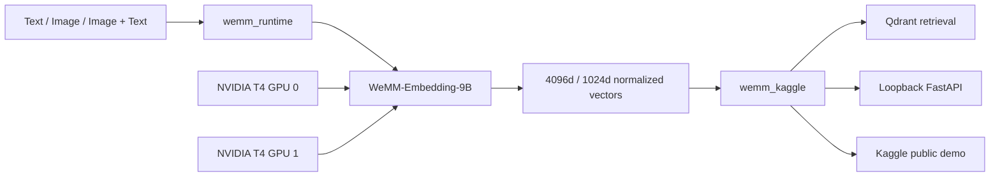

# Architecture

> 🌐 Language / Ngôn ngữ: **English** | [Tiếng Việt](architecture.vi.md)

The project separates the reusable embedding runtime from Kaggle-specific orchestration so the core model logic can be reviewed independently from notebook and hosting concerns.

## High-level flow



## Layers

### `wemm_runtime/`

Provider-neutral runtime primitives live here. Responsibilities include:

- validating the local model directory and required safetensors;
- enforcing offline/local model loading once the runtime begins;
- loading the processor and custom WeMM model code;
- validating the Hugging Face device map;
- enforcing supported Matryoshka dimensions;
- generating normalized text, image, and image+text embeddings.

### `wemm_kaggle/`

Kaggle integration lives here. It handles:

- resolving model files under `/kaggle/input`;
- preflight and environment checks;
- subprocess runtime lifecycle;
- Qdrant snapshot discovery/reuse;
- public demo orchestration;
- REST API configuration, validation, scheduling, and observability.

### `kaggle/`

Shell entry points create and validate the qualified runtime environment. The setup deliberately reuses Kaggle's existing CUDA-enabled PyTorch rather than installing a second Torch/CUDA stack.

## Dual-T4 placement

The verified FP16 configuration maps **37 model modules**:

| GPU | Modules |
| --- | ---: |
| GPU 0 | 13 |
| GPU 1 | 24 |

The qualified path allows neither CPU nor disk offload. Device-map validation rejects unsupported placement.

## Runtime isolation

The public integration runs model work through a subprocess worker. This design gives the notebook/API process a clear lifecycle boundary and makes GPU resource teardown more predictable at closeout.

## Embedding path

The runtime constructs multimodal chat-style inputs, runs the WeMM embedding path, pools the final hidden representation, and L2-normalizes the vector. For Matryoshka output, the vector is truncated to the requested supported dimension and normalized again.

Supported public dimensions:

- 4096
- 1024

## Retrieval path

Semantic retrieval uses verified Qdrant collections with named English/Vietnamese vectors. Visual robustness uses a separate temporary four-image gallery. The two spaces intentionally remain distinct; see [Retrieval and Evaluation](retrieval-and-evaluation.md).

## API path

The loopback API wraps the same runtime behind a bounded scheduler:

```text
HTTP request
  -> authentication / validation
  -> bounded queue
  -> runtime worker
  -> normalized embedding
  -> structured response + timing
```

The service is local/notebook-oriented, not an Internet-facing multi-tenant serving architecture.

## Related documents

- [Python Runtime](python-runtime.md)
- [REST API](api.md)
- [Qdrant](qdrant.md)
- [Reproducibility](reproducibility.md)
- [Limitations](limitations.md)
