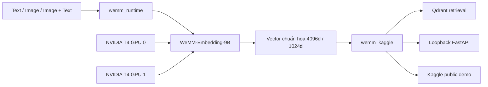

# Kiến trúc

> 🌐 Language / Ngôn ngữ: [English](architecture.md) | **Tiếng Việt**

Dự án tách reusable embedding runtime khỏi phần orchestration riêng cho Kaggle để logic model lõi có thể được review độc lập với notebook và hosting.

## Luồng tổng quan



## Các lớp chính

### `wemm_runtime/`

Chứa runtime primitive không phụ thuộc riêng nhà cung cấp. Trách nhiệm:

- validate local model directory và safetensors bắt buộc;
- enforce offline/local model loading khi runtime bắt đầu;
- load processor và custom WeMM model code;
- validate Hugging Face device map;
- enforce Matryoshka dimensions được hỗ trợ;
- tạo embedding chuẩn hóa cho text, image và image+text.

### `wemm_kaggle/`

Chứa integration dành cho Kaggle:

- resolve model dưới `/kaggle/input`;
- preflight và environment checks;
- subprocess runtime lifecycle;
- Qdrant snapshot discovery/reuse;
- public demo orchestration;
- cấu hình, validation, scheduling và observability cho REST API.

### `kaggle/`

Các shell entry point tạo và kiểm tra qualified runtime environment. Setup chủ ý tái sử dụng CUDA-enabled PyTorch có sẵn của Kaggle thay vì cài thêm một Torch/CUDA stack khác.

## Placement dual-T4

Cấu hình FP16 đã xác minh map tổng cộng **37 model modules**:

| GPU | Số module |
| --- | ---: |
| GPU 0 | 13 |
| GPU 1 | 24 |

Qualified path không cho CPU hoặc disk offload. Device-map validation sẽ từ chối placement không phù hợp.

## Runtime isolation

Public integration chạy model workload qua subprocess worker. Boundary này giúp notebook/API có lifecycle rõ ràng và giải phóng tài nguyên GPU có kiểm soát hơn khi closeout.

## Embedding path

Runtime tạo multimodal chat-style input, chạy WeMM embedding path, pool representation cuối và L2-normalize vector. Với Matryoshka output, vector được truncate về dimension yêu cầu rồi normalize lại.

Public dimensions được hỗ trợ:

- 4096
- 1024

## Retrieval path

Semantic retrieval dùng verified Qdrant collections với named vector Anh/Việt. Visual robustness dùng gallery tạm gồm bốn ảnh riêng biệt. Hai search space chủ ý không trộn lẫn; xem [Retrieval và Evaluation](retrieval-and-evaluation.vi.md).

## API path

Loopback API bọc cùng runtime phía sau bounded scheduler:

```text
HTTP request
  -> authentication / validation
  -> bounded queue
  -> runtime worker
  -> normalized embedding
  -> structured response + timing
```

Service hướng tới local/notebook, không phải Internet-facing multi-tenant serving architecture.

## Tài liệu liên quan

- [Python Runtime](python-runtime.vi.md)
- [REST API](api.vi.md)
- [Qdrant](qdrant.vi.md)
- [Reproducibility](reproducibility.vi.md)
- [Limitations](limitations.vi.md)
